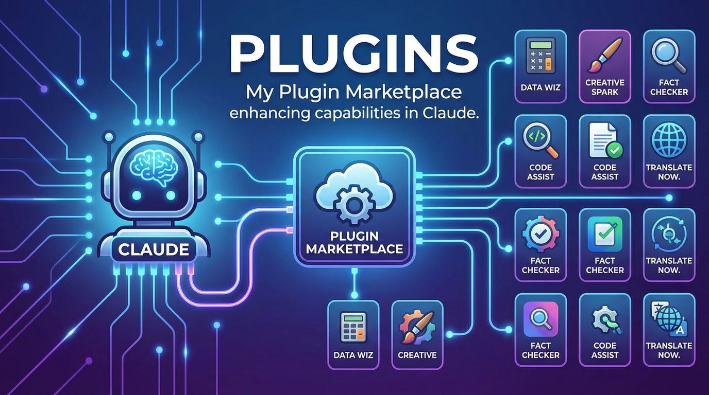

<!-- GENERATED from categories/08-plugins.md — do not edit directly. Run `npm run build`. -->

<!-- GENERATED FROM data/marketplace.json — do not edit by hand. Run scripts/sync_marketplace.py or npm run build. -->

# Plugins

All plugins registered in the [danielrosehill marketplace](https://github.com/danielrosehill/Claude-Code-Plugins). Install any of these with `/plugin install <name>@danielrosehill`.

## Systems Administration

### Desktop Manager
 

Claude Code plugin: Linux desktop management workflow — auto-profiles the local machine on first run and persists it to user data, then runs system checks, package install/remove, config application, hardware troubleshooting, service/log inspection against that profile.

---

### Security Auditor
 

Register machines and run repeatable Claude-Code-driven security audits over SSH, with timestamped reports and per-machine profiles.

---

### Security Checkup
 

Claude Code plugin: security and compliance workflow — vulnerability scanning, system hardening, config audits.

---

### Sysadmin Homelab
 

Claude Code plugin: sysadmin and homelab workflow — diagnose, status, update config, backup, with linux/docker/conda/proxmox/nas/adb/sbc/remote-admin/lan variants.

---

## Development & Debugging

### Debugging
 

Claude Code plugin: debugging workflow — capture logs, isolate issue, diagnose error, track bugs, with code/system/issue variants. Includes a KDE hotkey utility for capturing live system bugs.

---

### Dev Debugger
 

Bug-ticket workflow for development repos — capture bugs into planning/bugs/, dispatch specialist remediation agents (reproducer, diagnoser, patcher, fix-documenter), document fixes, and ship releases.

---

### Dev Tools
 

Claude Code plugin: dev-tools workflow — scaffold repos, multi-agent QA review, templatize. Session-handover commands and agent moved to claude-hopper in 1.2.0.

---

### Workspace Foundational
 

Claude Code plugin: foundational workspace workflow — setup, context management, report parsing, inventory, template discovery, with 6 variants.

---

## Meta & Context

### Claude User Memory
 

Backend-agnostic persistent user memory for Claude Code. Ships a save/recall/commit contract with personal/work context routing; bring your own memory MCP (Pinecone, Mem0, or other) via a workspace memory-config.md.

---

### Claude Vault
 

Meta-plugin for per-project activation of dormant plugins and MCP servers from a personal vault. Mitigates user-level eager skill description loading.

---

## Research & Investigation

### Ideation Planning
 

Claude Code plugin: ideation and planning workflow — capture, evaluate, rank, simulate, and plan ideas, with ideation/single-idea-eval/multi-idea-ranking/feature-ideas/simulation/idea-capture variants.

---

### Legal Investigative
 

Claude Code plugin: legal and investigative workflow — log evidence, analyze documents, redact, generate briefs, with legal-research/evidence/osint/document-analysis variants.

---

### Research Space
 

Claude Code plugin: research workflow — source log, summarize, deep-dive, export, with deep-research/technical/osint/georeaction/stack/ecosystem/competitor variants. Includes a 30-agent tech research team for hardware/software stack evaluations (folded in from Claude-Tech-Research-Team).

---

### Social Feedback
 

Check what people are actually saying about a topic, product, or provider by searching curated social-discourse sources (Reddit, Hacker News, Stack Exchange, Trustpilot, YouTube, Lobsters).

---

## AI & Prompts

### AI Attribution
 

Claude Code plugin: AI transparency workflow — document human vs AI contributions, add attribution, audit provenance.

---

### AI Engineering
 

Claude Code plugin: prompt engineering workflow — craft, eval, catalog, version, search prompts, with library/factory variants.

---

## Media & Content

### AI Video Producer
 

Drive an AI-generated video project end-to-end: creative brief, model selection, character sheets, script, storyboard, generation pipelines (text-to-image-to-video, voice-to-lip-sync, text-to-video, upscale), clip assembly, and final export. Ships fal.ai/Replicate/MiniMax MCP servers and fal-js + WaveSpeed Python SDK runners.

---

### Audio Production
 

Claude Code plugin: audio production workflow — normalize, VAD, transcribe, diarize, podcast assembly, with engineering/podcast/transcript variants.

---

### Claude Transcription
 

Claude Code plugin: audio transcription workflow — denoise, VAD, transcribe (Gemini/AssemblyAI/Whisper), clean, structure, export, with cloud and local engine backends.

---

### Media Library
 

Claude Code plugin: media library workflow — catalog, tag, search, sort, dedupe assets.

---

### PR & Media Work
 

Claude Code plugin: PR and media monitoring workflow — scan coverage, summarize press, draft responses, comms strategy, with monitoring/response/strategy variants.

---

### Video Editing
 

Claude Code plugin for video editing, transcoding, video processing, and multimedia workflow automation. Two-tier workspace (index + project), per-user data store, and a growing set of ffmpeg/MLT/Kdenlive primitives.

---

## Writing & Documentation

### Content Writing
 

Claude Code plugin: content writing workflow — draft, proofread, version, publish, style guides, with writing/blog/opinion/document variants.

---

### Knowledge Documentation
 

Claude Code plugin: knowledge documentation workflow — index, cross-link, build taxonomy, version docs, with wiki/resource-library/process-docs/experiment-report variants.

---

### Technical Docs
 

Claude Code plugin: technical documentation workflow — READMEs, reference docs, changelogs, environment docs, with api-reference/code-docs/environment-docs/dev-notebook variants.

---

## Personal & Planning

### Budgeting
 

Claude Code plugin: personal budgeting workflow — log transactions, categorize, forecast, track goals, monthly reports.

---

### Career
 

Claude Code plugin: career planning workflow — log roles, compare offers, track applications, salary benchmark, with planning/job-search/salary variants.

---

### Daniel Rosehill
 

Personal-use skills and slash commands for Daniel Rosehill — released publicly for convenience.

---

### Personal Planning
 

Claude Code plugin: personal life planning workflow — log entries, review progress, set goals, with diary/health/family/house-search/preparedness/personal-dev/inbox variants.

---

### Purchasing
 

Claude Code plugin: purchasing workflow — intake, compare products, evaluate options, recommend, with general/tech-procurement/recommendations variants.

---

### Shopping
 

Claude Code plugin: consumer shopping workflow — find product, compare vendors, check availability. Region-specific commands (e.g. Israel) now live in dedicated plugins like israel-skills.

---

### Therapy Tracking
 

Claude Code plugin for organising therapy reflections — pre/post-session notes, goal tracking, and turning voice-memo transcripts into structured problem summaries. Not therapy: organises notes only. Workspace data lives outside the plugin so the same install survives plugin updates.

---

## Home & Hardware

### HP5200 Printer
 

Claude Code plugin: HP DeskJet 5200 printer and scanner operations — ink levels, color/B&W printing, scanning, auto-discovery.

---

### Smart Home
 

Claude Code plugin: smart home workflow — Home Assistant, Snapcast multi-room audio, Plex media server ops, with HA/audio/media-server variants.

---

## Filesystem & Organisation

### Filesystem Organiser
 

Claude Code plugin: filesystem organisation workflow — scan, dedupe, cleanup, rename, sort for local directories and Google Drive, with local/gdrive variants. Includes organise-filesystem (modular modes) and super-organise (comprehensive single-pass) skills.

---

## MCP & Infrastructure

### Agent Relay
 

Direct agent-to-agent communication and coordination within a LAN. Two Claude instances on different machines exchange messages and files via a shared MCP relay server. Includes the relay server (Python/FastMCP, SQLite, content-addressed blob storage) and skills to deploy and connect clients. Trust-based, LAN-scoped.

---

## Adb

### Adb Ops
 

ADB (Android Debug Bridge) operations — onboard a phone, map folders, import media, capture screenshots, and manage bloatware with a persistent log.

---

## Air Quality

### Air Quality Toolkit
 

Look up current and historical air quality, calculate AQI from raw pollutant readings, and run modelling utilities. Defaults to WAQI with fallbacks to OpenAQ and AireLibre.

---

## Analysis

### Report Analyst
 

Skeptical analyst toolkit for long reports — READ/SKIM/SKIP verdicts, structured extraction (arguments, findings, stats, case studies, key snippets), and an opinionated executive summary. Built-in Jaded Report Reader persona that refuses credit for filler.

---

## Awesome List

### Resource List Builder
 

Claude Code plugin: build, maintain, and audit curated GitHub resource lists (Awesome-style indexes) with AI-driven categorisation, alphabetised tables, and dynamic shields.io badges.

---

## Backup

### Backup Planner
 

Plan, document, and implement a backup and data-protection strategy for the current project — from architecture discovery through script generation and restore drills.

---

## Btrfs

### Snap It
 

Manage BTRFS snapshots via snapper and btrfs from Claude Code — create, list, diff, rollback, and prune subvolume snapshots. Includes /snap and /snap-before commands for one-shot and pre/post-paired snapshots around risky changes.

---

## Business

### Business Idea Eval
 

Evaluate, refine, and develop business ideas through structured lenses — VC review, TAM, B2B/B2C fit, assumptions, objections, hardware feasibility, dev specs, timelines, social impact — plus an LLM council pattern (subagents or Karpathy clone), synthesis, and Typst PDF outputs for internal and public-facing docs.

---

## Buttondown

### Buttondown Mgmt
 

Manage one or more Buttondown newsletters from Claude Code — multi-newsletter config, reusable email templates, drafts, sends, subscribers, and API ops grounded in a locally cached copy of the official Buttondown docs.

---

## Claude Code

### Claude Code Feedback
 

File well-formed bug reports, feature requests, model-behavior reports, and documentation issues against anthropics/claude-code. Fetches the live issue templates, gathers required fields, and submits via gh CLI.

---

### Claude Hopper
 

Claude-Hopper — skills for hopping between discrete terminal-bound Claude Code sessions on Linux. Spawn new instances (Konsole), hand off context (full / clipboard / with-tasks), resume from handovers, and pick up leftover work.

---

### Claude Rudder
 

Claude-Rudder — collection of utilities to smoothen Claude Code UX. Context-gate workflow, log/blocker capture, plugin/MCP primitives, repo & docs spawning, and the canonical user-data storage convention. (Session-hopping skills moved to Claude-Hopper.)

---

### Style Switcher
 

Claude Code plugin: persona-recipe library for swapping Claude into themed personalities (Daredevil, Jaded IT, Reluctant, Chatty, Philosophical, Operational, Dubious, Hyper Creative, Approval Needed, Visionary, Claude FM, Claude Bouncer). Each recipe ships a banner image and sound effect, and applies via either a managed block in ~/.claude/CLAUDE.md or a repo-sandbox mode that holds the user CLAUDE.md aside.

---

## Claude MD

### Claude MD Tester
 

Safely swap ~/.claude/CLAUDE.md for test/joke configs via symlink. Terminal-only restore that does not depend on the Claude harness, so a hostile test config can never trap you.

---

### User Claude MD
 

Manage the user-level ~/.claude/CLAUDE.md and its chunked ~/.claude/context/ directory — audit, chunk, list, and edit global Claude Code user context for token efficiency.

---

## Copyq

### Copyq Scripting
 

Foundational advanced clipboard scripting skills for CopyQ on Ubuntu Linux — CLI reference, custom commands, tab/item management, global shortcuts, and command bundle import/export.

---

## Cups

### Network Cups
 

Discover, diagnose, and print to networked CUPS printers from Claude Code. Wraps the lan-mcp-cups MCP server and adds LAN discovery (avahi/Bonjour, arp-scan) plus ufw firewall sanity checks.

---

## Data Analysis

### Claude Data Analyst
 

First-pass data analysis toolkit: correlations, PII flagging, anomalies, hypothesis tests, data dictionaries, and trend analysis on a dataset in a folder.

---

## Data Cleaning

### Claude Data Wrangler
 

Data cleaning, enrichment, restructuring, packaging, and documentation skills for tabular and JSON datasets (no visualisation). 31 skills covering ISO standardisation, PII detection/synthesis, data dictionaries, SQL/graph/vector/HF/GeoJSON/API targets, date & Unicode hygiene, header & numeric-precision standardisation, multilingual header localisation, incremental upstream sync, and Typst-rendered PDF documents of the data.

---

## Data Ingestion

### Browser Data Capture
 

Streamline programmatic data ingestion against sites and apps that don't ship a documented API — capture network traffic (HAR, mitmproxy, or live tab via claude-in-chrome), map endpoints, infer schemas, and produce a draft OpenAPI spec you can build a stable client against. Ships skills for per-domain map documents, version-controlled storage in a private GitHub repo, and good-faith vulnerability disclosure if a finding turns up incidentally. White-hat use only.

---

## Data Visualisation

### Data Visualisation And Publishing
 

Create static and interactive data visualisations for reports, repos, and data storytelling. Purpose-organised inventory of 60+ validated open-source tools as a head start — static figures (Matplotlib, Seaborn, ggplot2), web charts (Chart.js, ECharts, Plotly.js, ApexCharts, Highcharts), high-perf (uPlot, Perspective, Lightweight Charts), bespoke (D3, Observable Plot, Vega/Vega-Lite, visx, Victory), Python/R apps (Bokeh, Dash, Altair, Streamlit, Gradio, Shiny, D-Tale, Briefer, Preswald), storytelling (Vizzu, VChart, vue-data-ui, SandDance), graphs (G6, sigma.js, Cytoscape, Gephi, Graphviz, GoJS, 3d-force-graph, Constellation), maps (deck.gl, react-map-gl, Leaflet, MapLibre, OpenLayers, folium, react-globe.gl), mobile (fl_chart, F2), BI (Superset, Metabase, Grafana, Kibana, Redash, Chartbrew), diagrams-as-code (Mermaid, PlantUML), domain-specific (Iris, QuantInvestStrats, XCharts, BizCharts, Tablesaw).

---

## Datasets

### Data Annotation
 

End-to-end data annotation toolkit. Prep raw data, design annotation schemas, annotate interactively with Claude (small scale) or scaffold Gemini batch inference (large scale), and publish to Hugging Face.

---

## Decision Making

### Decision Evaluation Framework
 

Apply 20+ classical decision-making frameworks (cost-benefit, pre-mortem, MCDA, decision tree, reversibility, regret minimization, OODA, Eisenhower, SWOT, second-order, opportunity cost, 10/10/10, inversion, base rates, Kepner-Tregoe, six hats, Cynefin, red-team, stakeholder map, time-horizon) to any major decision — parallel multi-lens analysis, synthesis, and Typst PDF export.

---

## Diagrams

### Nano Tech Diagrams
 

Generate, transform, and clean up tech diagrams and whiteboard photos via the Nano Banana 2 model (Fal AI). Wraps the nano-tech-diagrams MCP server with a curated prompt library across 5 diagram families and 28+ visual styles.

---

## Docs

### Repo To Content
 

Convert GitHub repos into polished content (PDF, white paper, internal doc, public-docs publication) via Typst, with optional AI banner generation and multi-target publishing.

---

## Donetick

### Donetick
 

Companion plugin for the donetick-mcp server. Bundles the MCP and adds skills for chore management against a self-hosted Donetick instance — daily brief, list/create/complete chores, label management.

---

## Education

### Teach This Repo
 

Uses a real code repository in reverse for developer education: assesses the learner's profile, builds a teaching plan grounded in the repo, writes lessons with code samples drawn from the source, and supports an interactive Q&A mode.

---

## Email

### Html Email Designer
 

Design and build responsive HTML email templates using Foundation for Emails, Maizzle, or MJML. Framework-agnostic authoring with email-client compatibility baked in.

---

## Forecasting

### Geopol Sim
 

Thin orchestrator for geopolitical forecasting simulations. Scaffolds, runs, bundles, and grades simulations from multiple decoupled upstream templates (lean LLM-council and snowglobe-style actor-simulation variants).

---

## Forensics

### Digital Evidence
 

General-purpose digital-evidence processing: capture, hash, OpenTimestamps, ExifTool/MediaInfo metadata, BagIt packaging, immutable sync. Layers with legal-investigative for full chain-of-custody workflows.

---

## Gimp

### Gimp
 

Bare-bones GIMP CLI wrapper for Linux: detect install (native/Flatpak/Snap/AppImage), persist a per-user profile, run Script-Fu batch ops, export images, install/list GIMP-side plugins.

---

## Github

### Gist Writer
 

Publish content to GitHub gists with clear AI authorship — Claude-authored solution gists and collaborative debug write-ups, both with model+date attribution, environment context, and a PII pre-flight scrub for public publishes. Visibility is a per-call parameter with a configurable default.

---

### Github Explorer
 

Semantic GitHub repo discovery for reusable components. Search, rank, overview, evaluate, and recommend open-source repos — Claude parses gh API results, weighing stars, activity, maintenance, license, and stack fit.

---

### Repo Mgmt
 

Repository management toolkit: organise and dedupe local repos, retrofit codebases with AI agent primitives, janitor-style cleanup, convert to Claude plugins, spin off breakaway or parallel-private repos; scan for dead remotes, missing clones, visibility risks, and stale archive candidates; bulk git ops across folders of clones plus an interactive PyQt6 prune GUI. Includes a preferences layer that remembers where different repo types live on disk. (PII scanning has moved to the standalone `pii-scanner` plugin.)

---

## Gpg

### Gpg Ops
 

GPG operations: generate keypairs, export public keys, encrypt, decrypt, sign, and verify files or text using the local GnuPG keyring.

---

## Greeninvoice

### Greeninvoice Ops
 

Operational commands and a skill for working with the Green Invoice MCP server — invoices, clients, expenses, and monthly summaries.

---

## Hardware

### Hardware Id Annotation
 

Identify and annotate hardware components from photos — circuit boards, motherboards, ICs — with overlays, datasheet cross-checks, and structured BOMs.

---

### Hardware Spec Assembly
 

Define hardware project BOMs with ESP32-first focus — onboarding captures location/vendors/on-hand gear, then skills for spec creation, budgeting, sourcing, compatibility checks, wiring specs, assembly instructions, 3D-printable suggestions, and AI-generated mockups via fal.ai nano-banana.

---

## Home Assistant

### Home Assistant Mgmt
 

Manage a Home Assistant instance via SSH and the HA REST API — guided first-run onboarding, automation/entity authoring, service calls, TTS testing, and log review. Per-host config is stored outside the plugin so the same install works across multiple Home Assistant environments.

---

## Image

### Background Removal
 

Remove image backgrounds via rembg — single-pass, two-pass cleanup, batch mode, and KDE Dolphin right-click integration.

---

### Image Annotation
 

Capture screenshots and apply annotations (arrows, callouts, boxes, highlights, blur/redaction) on Linux via Pillow + ImageMagick, with batch WebP conversion and PDF bundling. Originals are never modified.

---

### Image Production
 

Claude Code plugin: image production — editing, format conversion, batch ops, and filesystem organisation by resolution, aspect ratio, orientation, format, EXIF time, camera, plus dedupe and metadata scrubbing.

---

## Inventory

### Declutter Genie
 

Inventory analysis and decluttering assistant — import a household inventory in any format, then identify discards, duplicates, resale targets, donation targets (geo-aware), insurance-worthy items, and generate throw-out / giveaway lists as CSV or PDF.

---

## Israel

### Israel Agent Skills
 

Claude Code agent skills for Israel and Hebrew-specific workflows: Hebrew translation, Hebrew typography, emergency readiness utilities, and regional lookups.

---

### Israel Shopping
 

Israeli shopping workflows — tech retailers (Ivory, KSP, Bug, TMS), Zap price comparison, Hebrew term resolution, ILS conversion, RRP checks, PN cross-reference, brand identification, and AliExpress IL-context search (ILS/Hebrew, IL reviews, free-shipping, combo exclusion, local-vs-import compare).

---

## Jewish

### Jewish Texts Reference
 

Look up Jewish texts and references via the Sefaria MCP server — Tanakh, Talmud, Mishnah, Halakha, Kabbalah, commentary, dictionaries, and topics. Includes nikkud add/strip skills (Dicta nakdan + removenikud APIs, offline regex, unikud fallback).

---

### Jewish Utilities
 

Misc Jewish utility skills: shabbat candle-lighting/havdalah, zmanim (GR"A + MG"A), parsha-of-the-week, Hebrew/Gregorian date conversion (sunset-aware), upcoming holidays (IL/diaspora), and daf yomi. Wraps zmanim-mcp-server and hebcal MCP. Onboarding captures location for halachic-time skills. Companion to jewish-texts-reference.

---

## Kde

### Kde Plasma
 

KDE Plasma (Wayland) runtime utilities — KWin scripting, plasmoid management, panel layout backup, virtual desktops & activities, KGlobalAccel shortcuts, theme/look-and-feel switching, KDE Connect, Klipper, Baloo, kwriteconfig safe-edit, plasma-restart helpers, qdbus introspection, kscreen save/apply, KWallet ops. Complements generic Linux desktop-management plugins.

---

### Kde Plasmoid Dev
 

Skill for developing KDE Plasma plasmoids (QML/Plasma 6 desktop and panel widgets) — scaffold, debug, package, install, and migrate Plasma 5 → 6.

---

## Learning

### Test Project Ideator
 

Generates specifications for practice/dummy development projects tailored to the user's learning objectives, technology stack, and proficiency level in each language or tool.

---

## Licensing

### License Populator
 

Recommend, generate, and populate software/content licenses. Reads from a user-managed template store and advises on optimal license choice given desired freedoms and constraints.

---

## Linux

### Easy Effects Manager
 

Manage Easy Effects on Linux: maintain a preset library, install/export presets, bind autoload to specific mics, test input levels, and set up clean voice-dictation chains. Works with Flatpak or native installs.

---

### Keyboard Scanner
 

Profile Linux keyboards, scan keycodes, and surface underused keys for remapping. Walks intake → keycode dump (xmodmap/XKB/evdev/libinput, X11 + Wayland) → tailored remap suggestions referencing keyd, kmonad, xremap, xmodmap, xbindkeys, input-remapper, autokey.

---

### Linux Av Manager
 

Manage antivirus, rootkit-detection, and UFW host firewall on a Linux desktop — install ClamAV/ClamTk/rkhunter (core) plus optional advanced tools (Lynis, chkrootkit, AIDE, debsecan), keep definitions current, run scans, schedule periodic runs, and configure conservative desktop-tuned UFW rules. Scan results stored in a user-defined folder set up on first run.

---

### Linux Debugging
 

Linux desktop debugging toolkit — targeted journal/boot/log inspection skills plus proactive logging instrumentation (persistent journald, kdump, sysstat, OOM protection) so AI agents can analyze hard crashes, freezes, and runtime issues. Targets Ubuntu + Wayland; forkable for other distros.

---

### Linux Packaging
 

Linux packaging and release workflows — Debian/.deb builds, npm publishing, GitHub release creation, agent deploy scripts, and local debugging

---

### Linux System Optimisation
 

Performance and space optimisation for Linux desktops — hardware-aware CPU/GPU/disk/memory benchmarks with governor / I/O scheduler / sysctl tuning, plus disk-usage analysis (BTRFS-aware), duplicate-file detection, package audit, and dev-clutter pruning (venvs, node_modules, caches).

---

### Os Sync Agent
 

Hardware-aware desktop-to-laptop environment sync for Ubuntu/Debian. Snapshots packages (apt/snap/flatpak/pip/conda/ollama) and dotfiles from a base machine and a remote machine over SSH, then produces an incremental install/remove/sync plan rather than a perfect clone. Ships /sync-os command and sync-environments skill.

---

## Llm Council

### Llm Council Creator
 

Scaffold new LLM Council projects from existing templates (Template, Grounded, Decide) or build bespoke council repos for specific purposes.

---

## Music Assistant

### Media Assistant Ops
 

Interface with a Music Assistant server via its local API — onboard a deployment, control players, snapshot speaker rosters, save/update per-player DSP presets, and apply a curated podcast EQ preset.

---

## Nfc

### Nfc Ops
 

NFC tag operations using libnfc — read, write, inspect, password-protect, and bulk-write from CSV with manual tag-by-tag feed.

---

## Nlp

### Text Corpus Analysis
 

Skills for analyzing large text corpora — topic modeling (BERTopic with temporal evolution), NER, categorization into fixed taxonomies, bottom-up category derivation, multi-level taxonomy design, word frequency, synonym clustering for voice-note/STT corpora, parametric stats, and metadata↔content correlation. Three execution lanes (classical NLP, local LLM via Ollama, cloud LLM via OpenRouter) with explicit cost-awareness: mandatory pre-run estimates for >1k-doc LLM passes, two-pass cheap→premium pattern, embeddings+clustering preferred over pairwise LLM comparison.

---

## Obs

### Obs Mgmt
 

Manage OBS Studio on Linux from Claude Code: detect install type (native/Flatpak/Snap/AppImage), enable and validate obs-websocket, ship a bundled obs-mcp MCP server for programmatic OBS control, back up configs to a user-defined folder, and install third-party OBS plugins.

---

## Openrouter

### AI Model Research
 

Research, discover, compare, and evaluate AI models on OpenRouter — backed by the bundled Model-Scout MCP server for live catalog data with caching. Subsumes the standalone open-router-model-research plugin and the Model-Scout-MCP server. 11 skills cover lookup, capability filtering (tools, vision, audio), recommendation, head-to-head comparison, deep evaluation, workload cost projection, and finding cheaper alternatives.

---

## Opnsense

### Opnsense Mgmt
 

Manage an OPNsense router/firewall via SSH and the OPNsense API — guided first-run onboarding, firewall rule inspection, network debugging, and host/log diagnostics. Per-host config is stored outside the plugin so the same install works across multiple environments.

---

## Optical

### Batch Optical Archivist
 

Plan and burn batch M-Disc / BD-R / DVD archives from a source directory on Ubuntu, with copy multipliers for offsite duplicates. Wraps growisofs, xorriso, and dvd+rw-mediainfo; optional K3B handoff for manual fallback.

---

## Pdf

### Digital Printing
 

Skills and an orchestrator agent for preparing PDFs for digital printing — resize, grayscale, font embedding, transparency flattening, image downsampling, color normalization, watermarks, footer burn-ins, cover pages, bleed-safety check, job folders, formal print orders, and email/Drive share.

---

### Document To Markdown
 

Convert PDFs to clean Markdown, chunk into logical sections (chapters, indexes, appendices), and extract embedded tables to CSV. Local-first via marker/docling/pymupdf4llm + camelot/tabula, with TOON manifests.

---

## Pipewire

### Claude Pipewire Skills
 

Claude Code skills for taming Pipewire/Wireplumber audio on Linux — manage default devices, persistent device-priority rules, per-app routing, mic level checks, and EasyEffects bindings.

---

## Planning

### Claude Document Nudge
 

Nudges Claude to document decisions, todos, sprints, and handovers into a structured planning/ tree by default — without being asked each turn. Ships a home-level CLAUDE.md snippet plus /nudge-install and /nudge-scaffold slash commands.

---

## Plugins

### Favorite Plugins Installers
 

Curated batches of third-party Claude Code plugins, grouped by type/theme, installable in one command.

---

## Privacy

### Pii Scanner
 

Scan files, directories, or git repositories for personally identifiable information — credentials (gitleaks), generic PII (Microsoft Presidio), and matches against a user-maintained personal PII inventory (names, addresses, family, IDs) stored locally.

---

## Productivity

### Schedule Manager
 

Personal schedule, task, and meeting management. Routes mixed brain-dumps into Google Calendar (events) and Todoist (tasks); manages agenda/minutes Google Docs linked to events; produces wrapup logs and morning briefs. 22 skills covering Calendar/Todoist CRUD, firehose routing, task<->event migration, priority/date hygiene, and agenda/minutes lifecycle.

---

## Proxmox

### Proxmox Mgmt
 

Manage a Proxmox VE host via SSH and the Proxmox API — guided first-run onboarding, VM/CT lifecycle, storage and ZFS inspection, log review, and update workflows. Per-host config is stored outside the plugin so the same install works across multiple Proxmox environments.

---

## Recovery

### System Recovery Mode
 

Claude Code plugin: AI-assisted Linux system recovery — slash commands and agents (diagnose, logs, network, disk, services, packages) for diagnosing and fixing a broken system. Pairs with an optional GRUB/systemd installer that boots a minimal recovery TTY straight into Claude CLI.

---

## Resume

### Resume Typesetter
 

Manage a resume as JSON Resume schema data and render it with custom Typst templates. Onboard, iterate, fork variants, and version.

---

## Scraping

### Local Web Capture
 

Capture geo-restricted web content (articles, prices) via the user's own localhost so requests exit via the user's IP. Headless-first escalation ladder (Scrapling static -> stealth -> Playwright -> real Chrome via bb-browser). Project-local save (in-repo captures/) with global fallback. Batch capture with human + agent summaries, Typst PDF compilation, and arbitrary-language capture+translate (default Hebrew -> English).

---

## Sop

### Sop Writer
 

Project-scoped authoring tools for Standard Operating Procedures and decision flowcharts. Scaffold from templates, embed Mermaid/D2 diagrams, compile to printable PDFs via Typst, and assemble multi-document binders with TOC and page numbers.

---

## Spam

### Spamhole
 

Claude Code plugin: AI-assisted defenses against pseudo-personalised wide-scrape outreach, AI-faked impersonation, and tracking-pixel surveillance. Capture spam to a personal corpus, analyse intent, suggest filter patterns, scan for tracking + ad-tracker pixels, draft unsubscribe replies, push server-side Gmail blocks via an email MCP, push DNS-level blocks to AdGuard Home, and contribute redacted findings to public anti-tracking lists. Bundles a stub AdGuard Home MCP.

---

## Spec

### Spec Starter
 

Spec-driven development workflow for Claude Code: turn unstructured project briefs (especially voice transcripts) into a versioned spec, modular context, and a CLAUDE.md scaffolded into your current repo.

---

## Staging

### Loose Tasks
 

Loose skills that will be migrated into other plugins later. Recommended not to enable/use this!

---

## Synology

### Synology Mgmt
 

Manage a Synology NAS via SSH — guided first-run onboarding, share/volume inspection, storage health, and file operations. Per-host config is stored outside the plugin so the same install works across multiple NAS environments.

---

## Synthetic Data

### Synthetic Data
 

Generate synthetic datasets from schemas, real data, or LLM-driven personas. Tabular fit-and-sample (SDV: GaussianCopula, CTGAN, TVAE), Faker/Mimesis schema generation, deterministic PII swap, LLM-driven real-to-synth conversion for unstructured records, and SDMetrics-based quality/privacy evaluation (plus embedding-based leakage checks for text).

---

## Task Management

### Task Queuer
 

Repo-based task queueing system with categorisation and prioritisation. Scaffolds a planning/ folder, logs tasks (single, batch list, or voice-transcribed), buckets them by category, and hands prioritised work off to the repo's orchestration agent.

---

## Taxonomy

### Taxonomy Creation
 

Generate taxonomy and lookup tables (countries, currencies, languages, US states, timezones, custom domain taxonomies) and load them into Postgres, SQLite, MySQL, or export to CSV/JSON/SQL seed files. For data engineers, CMS builders, and eval pipeline authors.

---

## Text

### Novelty Text Editor
 

Rewrite text in deliberately ridiculous styles — Shakespearean, medieval, archaic, chaos-case, over-salesy, platitude-stuffed, pseudobot, plus length transforms (elongate / truncate). Nine no-config skills for stylistic mischief.

---

## Toon

### Get Toony
 

Convert JSON, CSV, YAML, and other structured data into TOON (Token-Oriented Object Notation) — a compact, lossless re-encoding that uses ~40% fewer tokens than JSON when fed to LLMs. Wraps @toon-format/toon and tracks the wider ecosystem (Python, Java, .NET, PHP, Rust ports).

---

## Tts

### Text To Speech Toolkit
 

Skills for preprocessing text for TTS engines — SSML conversion, ElevenLabs markup (grounded in live ElevenLabs prompting docs), TTS safety review, and manual prosody addition. Non-destructive by default: edits land in an edited/ folder alongside an unchanged original/ copy.

---

## Typst

### Programmatic Doc Generation
 

Build programmatic document generation pipelines — Typst templates for local batch rendering, plus integration scaffolding for n8n and cloud rendering services (Carbone, PDFMonkey, APITemplate, DocRaptor, Docmosis, Adobe Doc Gen).

---

## Userscript

### Userscript Development
 

Develop, test, and publish Tampermonkey userscripts — scaffolding, in-browser validation via Claude in Chrome, README generation, and version bumping.

---

## Visuals

### Visual Communications
 

Plan and prompt-engineer AI-generated visuals (images, diagrams, video) for whitepapers, blog posts, and long-form content. Six skills cover project onboarding, visual ideation, prompt generation, project listing, fal-ai execution, and a resolution/style reference.

---

## Voice

### Claude Pa
 

Claude Code plugin: passive-aggressive PA system. Claude barks status updates over a speaker; if ignored, escalates across the house via Home Assistant or MQTT. Includes pre-recorded voice packs, RGB signal bulb, full-screen flash overlay, and a quiet-mode skill that translates natural-language pause/schedule requests.

---

## Zigbee

### Zigbee Home Maintenance
 

Maintain a home Zigbee network — onboard MQTT broker, coordinator (SMLight / Sonoff / ConBee / etc.), and Home Assistant; manage credentials, network exports, and routine maintenance.

---
